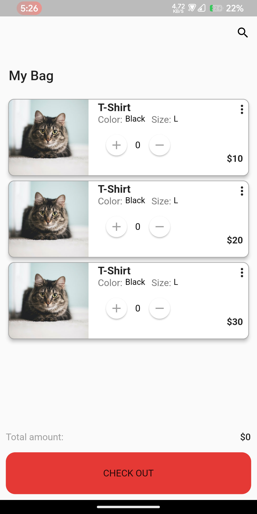
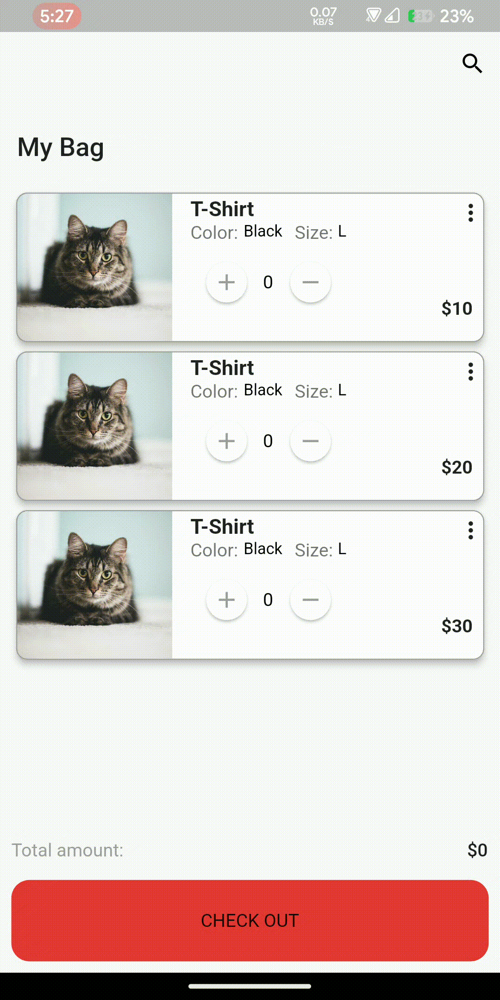

# Design the following screen.

## Requirement:

- On pressing the + and - icons:
- The no of item will increase/decrease
- Total amount will be the calculated according to the number of items and unit price
- On pressing CHECK OUT a snackbar will appear with a congratulating message.
- Don’t need to implement any other click events.

### The design must be responsive.

