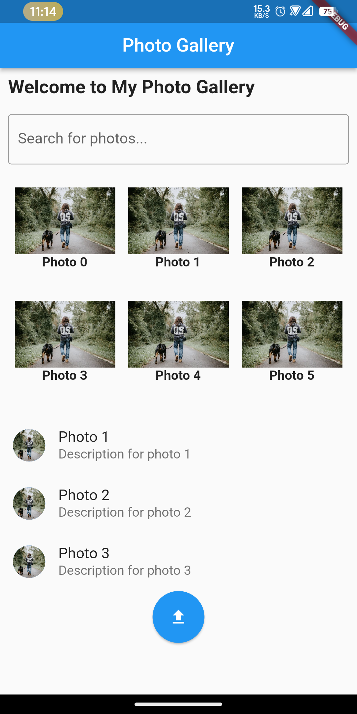
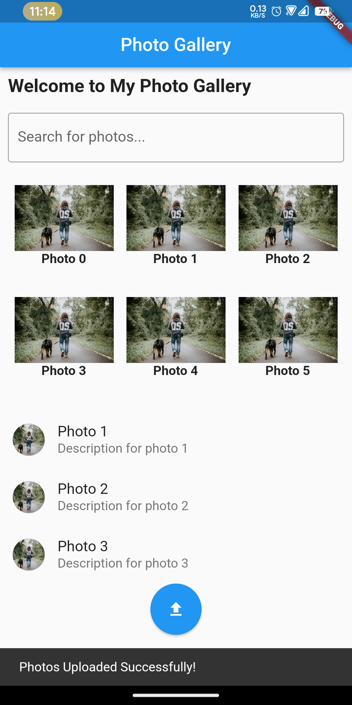

# module6_assignment

## Flutter Essential Widgets
Create a Flutter app with the following features:
 
- An app bar titled "Photo Gallery"
- A scrollable view with a welcome message.
- A text field.
- A grid of at least 6 network images with captions.
- Each image triggers a Snackbar when clicked, you can show any text on the message.
- Below the grid, a list of three sample photos with titles and subtitles.
- An upload button that shows the message “Photos Uploaded Successfully!” in a Snackbar.
- Use any font style or icon size that makes the UI visually appealing.

